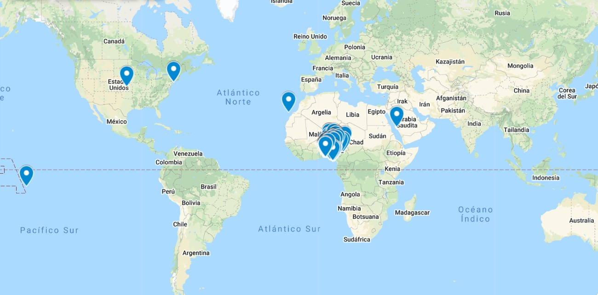

# Data Project 3: Predicción del Riesgo Crediticio.

- [Héctor García Jiménez](https://www.linkedin.com/in/hhectorgarcia/)
- [Sergi Garcia Micó](https://www.linkedin.com/in/sergi-garcia-mic%C3%B3-6b4455161/)
- [Malena Martín De Hoyos](https://www.linkedin.com/in/malena-mart%C3%ADn-a027bb201/)
- [Pablo Sánchez Sáez](https://www.linkedin.com/in/pablo-s%C3%A1nchez-s%C3%A1ez/)
- [Lluna Sanz Montrull](https://www.linkedin.com/in/llunasmontrull/)

# Proyecto
## Contexto

Bbank (entidad bancaria ficticia) es un banco ético de reciente creación.
Se trata de uno de los bancos más sostenibres del mundo. Hacen que el dinero trabaje para lograr un cambio social, ambiental y cultural positivo.

## Objetivos

- Realizar un clustering para ver qué tipos de cliente tiene el banco.
- Desarrollar un clasificador que pueda predecir si el préstamo será bueno o no.
  - Teniendo en cuenta que los préstamos malos aprobados son el 21,77%, el modelo debería de tener un recall significativamente superior al 78,23% para que marque una diferencia al procedimiento de aprobaciones de préstamos por parte de bbank (el modelo base).

# Ejecución en entorno local

# Discusión
## Análisis exploratorio de datos
Todos los datasets se componen de un dos archivos: uno de entrenamiento y otro de test.
### Datos demográficos
**Report detallado aquí**

Se descarta la columna de _bank\_branch\_clients_ puesto que, en total, los valores vacíos representan 99% de los datos de la columna y, por tanto, dicha variable no aportará información relevante. Por otra parte, se tiene en cuenta que la columna _level\_of\_education\_clients_ pueda ser poco relevante por tener un 86% de los valores vacíos.

Como se observa en el report de los datos descriptivos, casi todos los clientes se sitúan en unas coordenadas determinadas, concretamente en Nigeria.

### Datos de préstamos anteriores
**Report detallado aquí**

### Datos de rendimiento (performance)
**Report detallado aquí**

## Transformación de los datos
### Datos demográficos

### Datos de préstamos anteriores

### Datos de rendimiento

## Reducción de la dimensionalidad

## Clustering

## Clasificación

# Limitaciones
(FIXME) Si este modelo tiene que sustituir al método de aprobación automática de préstamos, necesitaríamos también de aquellos datos de los préstamos rechazados (puesto que sólamente tenemos los aprobados). Aquí sólamente tendríamos los verdaderos positivos y falsos positivos de los préstamos que pasan a ser aprobados o rechazados. En el dataset, sólo se tenemos verdaderos positivos y falsos positivos. Sería más interesante contar con los datos de los verdaderos negativos y falsos negativos (es decir, los prestamos malos rechazados y los préstamos buenos aprobados respectivamente).

# Futuras líneas de trabajo
(FIXME) Poner el tema que se van a necesitar más datoss.

# Conclusiones

