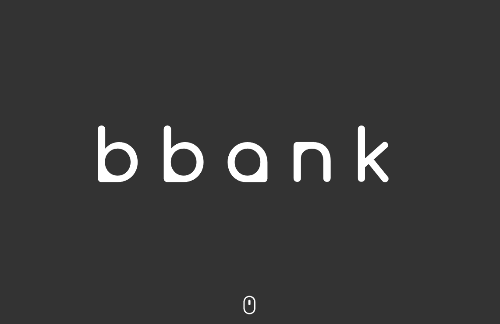

# Data Project 3: Predicción del Riesgo Crediticio.

- [Héctor García Jiménez](https://www.linkedin.com/in/hhectorgarcia/)
- [Sergi Garcia Micó](https://www.linkedin.com/in/sergi-garcia-mic%C3%B3-6b4455161/)
- [Malena Martín De Hoyos](https://www.linkedin.com/in/malena-mart%C3%ADn-a027bb201/)
- [Pablo Sánchez Sáez](https://www.linkedin.com/in/pablo-s%C3%A1nchez-s%C3%A1ez/)
- [Lluna Sanz Montrull](https://www.linkedin.com/in/llunasmontrull/)

# Proyecto
## Contexto

Bbank (entidad bancaria ficticia) es un banco ético de reciente creación.
Se trata de uno de los bancos más sostenibres del mundo. Hacen que el dinero trabaje para lograr un cambio social, ambiental y cultural positivo.

## Objetivos

- Realizar un clustering para ver qué tipos de cliente tiene el banco.
- Desarrollar un clasificador que pueda predecir si el préstamo será bueno o no.
- Teniendo en cuenta que los préstamos malos aprobados son el 21,77%, el modelo debería de tener un recall significativamente superior al 78,23% para que marque una diferencia al procedimiento de aprobaciones de préstamos por parte de bbank (el modelo base).

## Repositorio

```
data-project-3
├───clustering
│   │
│   ├───files
│   │   ├───datosdemograficos\_limpio.csv
│   │   │
│   │   ├───performancelimpio.csv
│   │   │
│   │   └───previous\loan\_limpio.csv
│   │
│   └───notebooks
│       ├───Clustering.ipynb
│       │
│       ├───Datos\_Demograficos.ipynb
│       │
│       ├───Performance.ipynb
│       │
│       └───Previous\_loan.ipynb
│
├───etc
│   ├───bbank\_logo.png
│   │
│   ├───mapa\_0.jpeg
│   │
│   └───mapa\_2.jpeg
│
├───raw\_data
│   ├───SampleSubmission.csv
│   │
│   ├───test\_datos\_demograficos.csv
│   │
│   ├───test\_performance.csv
│   │
│   ├───test\_previous\_loan.csv
│   │
│   ├───train\_datos\_demograficos.csv
│   │
│   ├───train\_performance.csv
│   │
│   └───train\_previous\_loan.csv
│
├───reports
│   ├───EDA.py
│   │
│   ├───demographic\_data\_report.html
│   │
│   ├───performance\_data\_report.html
│   │
│   ├───previous\_data\_report.html
│   │
│   ├───test\_performance\_data\_report.html
│   │
│   └───train\_performance\_data\_report.html
│
├───.gitignore
│
├───Dockerfile
│
├───EDA\_classification.ipynb
│
├───Makefile
│
├───README.md
│
└───requirements.txt

```

# Ejecución en entorno local
Se clona el repositorio:
- HTTPS
`git clone https://github.com/llunasanz/data-project-3.git`

- SSH
`git clone git@github.com:llunasanz/data-project-3.git`

- GitHub CLI
`gh repo clone llunasanz/data-project-3`

En la consola de comandos, dentro de la carpeta del repositorio, se ejecuta el comando `make` o `sudo make` (en caso de tener problemas con los permisos).

Una vez aparezca el siguiente log, que indica el fin de la ejecución de los procesos del contenedor, se accede al entorno de Jupyter Lab mediante el último enlace que aparezca en consola:

```  
[C 2022-05-11 17:44:48.558 ServerApp]  
  
    To access the server, open this file in a browser:
        file:///home/jovyan/.local/share/jupyter/runtime/jpserver-7-open.html  
    Or copy and paste one of these URLs:  
        http://dc3320ece626:8888/lab?token=a18d3c4cdb4776e7b1f8e14b86f084aa203e8540cdc8d16b  
     or http://127.0.0.1:8888/lab?token=a18d3c4cdb4776e7b1f8e14b86f084aa203e8540cdc8d16b  
  
```
**Nota**: para acceder directamente a Jupyter Notebook, reemplaza *tab* por *tree* en el enlace.

Una vez dentro, se accede a la carpeta de work donde se encontrará el repositorio descargado y con los notebooks a ejectuar de acuerdo con lo descrito en el subapartado de *Repositorio*.

## Vídeo de demostración
https://youtu.be/evEfN-wHDrk

En el video demostración se puede observar los pasos a seguir para realizar:

1- ETL
2- Clustering
3- PCA
4- Clasificador

# Limitaciones del proyecto
(FIXME) Si este modelo tiene que sustituir al método de aprobación automática de préstamos, necesitaríamos también de aquellos datos de los préstamos rechazados (puesto que sólamente tenemos los aprobados). Aquí sólamente tendríamos los verdaderos positivos y falsos positivos de los préstamos que pasan a ser aprobados o rechazados. En el dataset, sólo se tenemos verdaderos positivos y falsos positivos. Sería más interesante contar con los datos de los verdaderos negativos y falsos negativos (es decir, los prestamos malos rechazados y los préstamos buenos aprobados respectivamente).
Se desconoce el procedimiento manual que ha seguido bbank para aprobar los préstamos.


